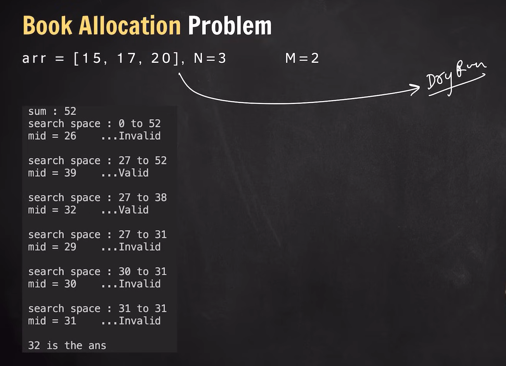
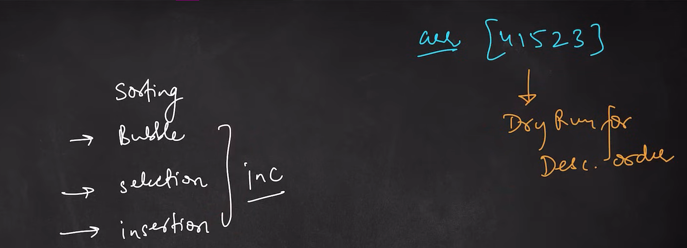

### To Run 
g++ 4-Pattern.cpp -o 4-Pattern.exe && .\4-Pattern.exe

g++ filename.cpp -o filename.exe && .\filename.exe

Next Pattern to do

DRY run book allocation on this range

decreasing order for sorting algo

slow and fast pointer approach - questsion 287 on leetcode